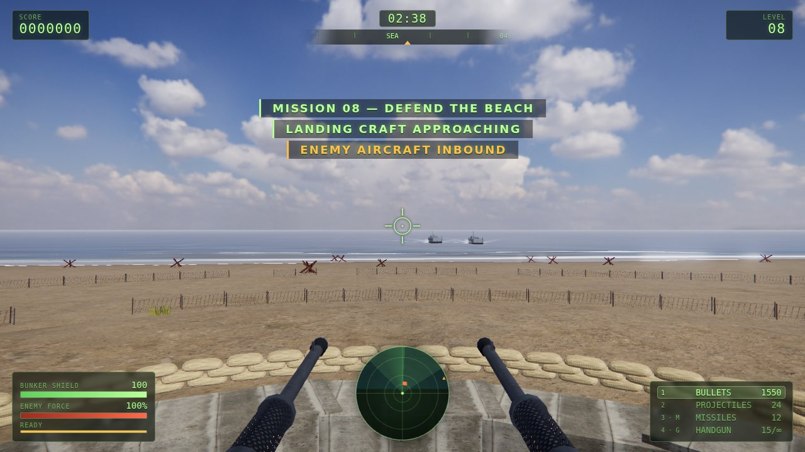
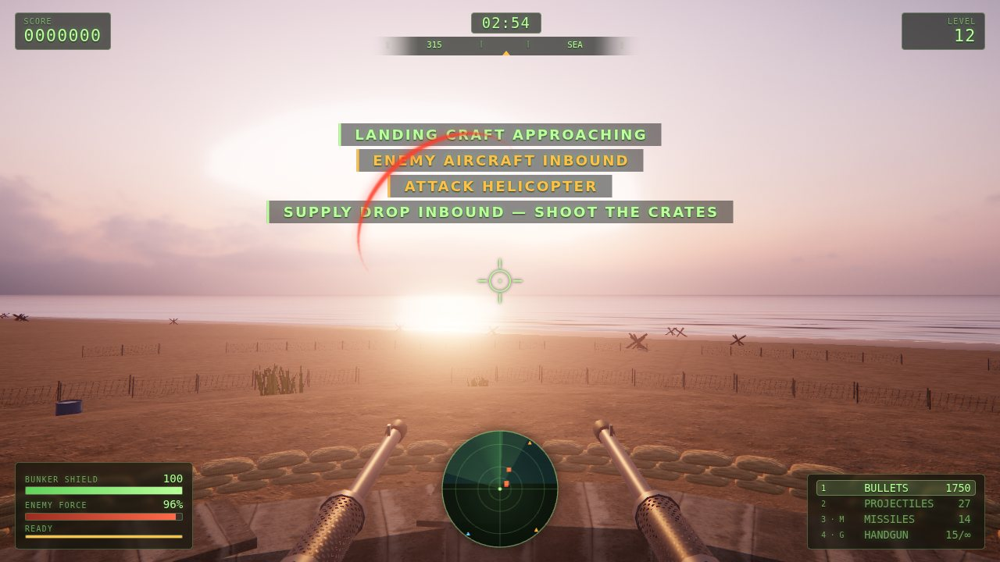
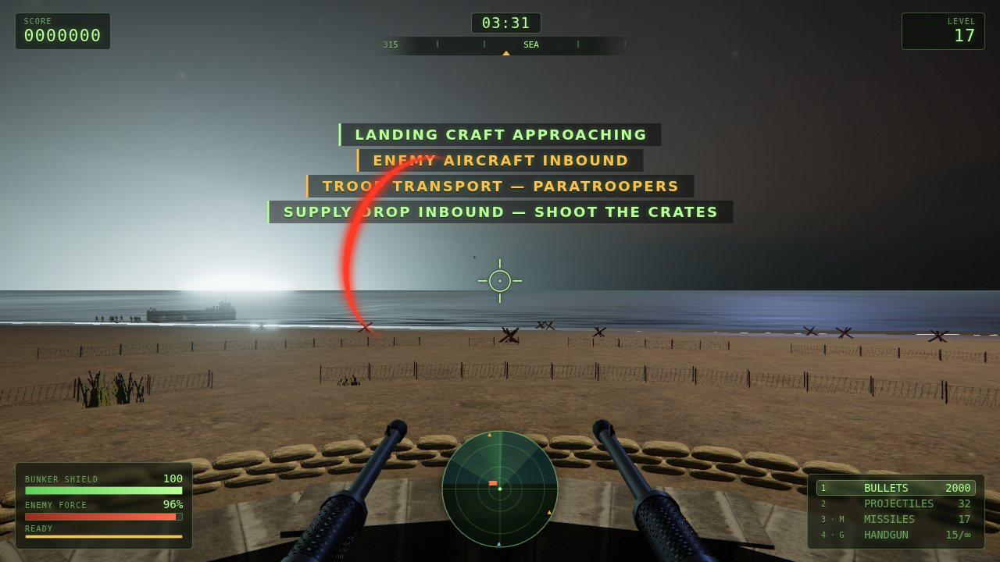
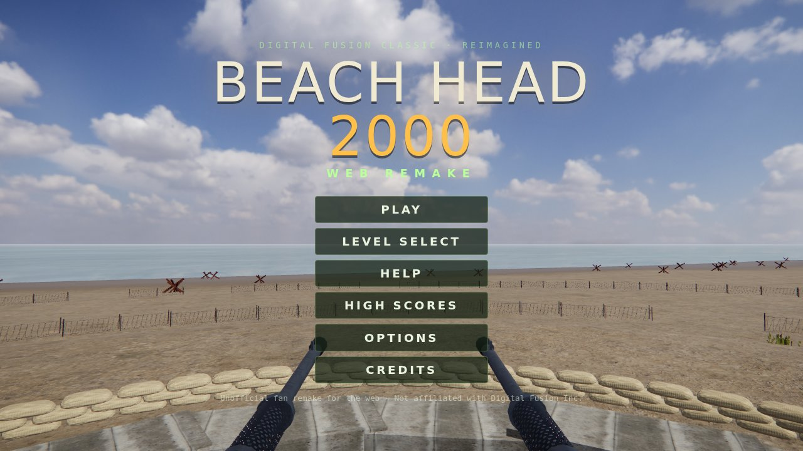

# Beach Head 2000 — Web Remake

An unofficial, non-commercial fan remake of **Beach Head 2000** (Digital Fusion, 2000) that runs in the browser.
The gameplay, rules and screen layout follow the original as closely as possible. The graphics are rebuilt with
modern real-time rendering: HDRI skies, a physically based sea with breaking surf, height haze, PBR materials,
shadows, bloom and GPU particles. Five quality settings keep it playable on old integrated graphics.

> Built with [three.js](https://threejs.org) and [Vite](https://vite.dev). No original game assets are used.
> Vehicles, aircraft, soldiers, effects and every sound are generated procedurally. Environment textures and HDRIs
> come from [Poly Haven](https://polyhaven.com) (CC0). See [`public/assets/CREDITS.md`](public/assets/CREDITS.md).

| Day | Dusk |
| --- | --- |
|  |  |
| **Night** | **Main menu** |
|  |  |

## How to play

You are the lone gunner in a rotating turret on the beach. Destroy every landing craft, tank, APC, helicopter
and fighter to finish the mission. Bombers do not have to be destroyed, but you must survive them.
The game ends when your **bunker shield** reaches zero. There are **60 missions**, and each one is harder than the last.

| Input | Action |
| --- | --- |
| Mouse | Rotate the turret 360° and aim (up/down travel is limited like a firing slit) |
| Left button | Fire (hold for automatic) |
| Space / right button | Toggle **machine gun ↔ anti-tank gun** |
| M | **Guided missiles**: lock onto vehicles and aircraft; at most 2 in the air |
| G | **Handgun**: replaces the right barrel, 15-round magazine, unlimited reserve |
| H | **155 mm howitzer** (only on some missions) |
| 1–5 / wheel | Select weapon |
| R | Reload handgun |
| + / − | Mouse sensitivity |
| Esc / P | Pause |

- **Ammunition is limited** for each mission, as in the original. A friendly supply plane drops parachuted crates.
  Shoot a crate **before it touches the ground** to collect it:
  - a yellow **X** crate holds ammunition;
  - a red-cross crate repairs the shield.
- **Enemy types:**
  - infantry landing from boats, dropping by parachute or dismounting from APCs;
  - LCT landing craft, M113 APCs and M48 tanks;
  - AH-1 Cobra attack helicopters and CH-53 troop transports;
  - F-4 fighters making strafing and bombing runs;
  - B-52 carpet bombers.
- **Radar:** the sea is at the top.
  - Red squares are boats and vehicles.
  - Orange triangles are aircraft.
  - Blinking yellow marks bombers.
  - White marks supply crates.

## Development

Requires Node.js 22.12 or newer.

```bash
npm install
npm run dev        # http://localhost:5173
npm test           # level generator + math unit tests
npm run build      # production build in dist/
npm run preview    # serve the build
```

Useful URL flags for development:

| Flag | Effect |
| --- | --- |
| `?debug` | FPS / draw-call counter and cheat keys: K kill all, I invulnerable, F refill ammo |
| `?autostart&level=12` | Jump straight into a mission |
| `?quality=auto\|low\|medium\|high\|ultra` | Override the graphics preset |
| `?time=day\|dusk\|night` | Override the time of day |
| `?seed=1` | Deterministic spawns |
| `?nolock` | Drag to aim instead of pointer lock (automation) |
| `?mute` | No audio |

`window.__bh` exposes a small automation API: `start(n)`, `advance(sec)`, `aim(yaw, pitch)`, `fire(sec)`,
`killAll()`, `stats()`, `bench(frames)` and more (see `src/debug/Debug.js`). `npm run smoke` drives the game in headless Chromium
with Playwright and saves screenshots to `artifacts/`.

### Graphics quality

**Options → Graphics quality** offers Auto, Low, Medium, High and Ultra.

- **Auto** (the default) picks a tier from the GPU name. Old Intel HD/UHD graphics get Low, Iris Xe / Radeon
  integrated / Apple M1 get Medium, and discrete GPUs get High. Auto never picks Ultra.
- While playing, Auto lowers the render resolution when frames get slow and raises it again when there is
  headroom (down to `dynResMin`).
- If the game is still too slow at the lowest resolution, Auto drops one tier at the next mission briefing, never
  in the middle of a fight. The choice is remembered for that GPU.
- With `?debug` or **Show FPS**, the counter shows the tier and the current resolution scale.

| | Low | Medium | High | Ultra |
| --- | --- | --- | --- | --- |
| Resolution scale | 0.75 (Auto: 0.5–0.75) | 1.0 | 1.25 | 2.0 |
| Post-processing | none: renders straight to the screen | bloom, grade, MSAA 2× | + MSAA 4×, sun shafts | same |
| Shadows | off | 1024 | 2048 | 4096 |
| Sea | 4 waves, sky reflection | 6 waves, planar reflection 256, boat wakes | 8 waves, reflection 512 | 8 waves + fine ripples, reflection 1024 |
| Terrain grid / explosion lights | 192 / 1 | 256 / 2 | 320 / 4 | 400 / 4 |

All presets live in `CONFIG.quality` (`src/config.js`).

### Sea and shore rendering

The water model is adapted to WebGL from [dgreenheck/tidewater](https://github.com/dgreenheck/tidewater) (MIT).
Only the parts that are cheap in a single shader pass are used. Because the camera never leaves the bunker, the
seabed is known analytically and no screen-space refraction or reflection passes are needed.

- **Waves.** A Gerstner swell (`src/world/waves.js`) fades out in shallow water, long waves first. The landing
  craft float on the same waves, computed on the CPU.
- **Surf.** `src/world/ShoreField.js` bakes the depth and the wave travel time to the shore. Analytic breakers
  (`src/world/shaders/shore.glsl.js`) shoal, break and run up the sand. The beach shader uses the same model, so
  sand darkens under each swash and dries afterwards.
- **Water shading.** Exact Fresnel; sky reflection whose roughness grows with distance (Cox-Munk); a GGX sun
  glint; light absorbed and scattered along a refracted ray down to the sandy bottom; bright wave crests where the
  sun shines through them; lace foam from whitecaps, surf and boat wakes; wind gusts and glassy slicks across the
  open sea.
- **Haze.** Two-layer height haze tinted towards the sun replaces three's exponential fog for every material
  (`src/world/shaders/haze.glsl.js`).

### Assets

The CC0 assets are committed in `public/assets`. `npm run fetch-assets` downloads them again from Poly Haven,
verifies checksums and regenerates `CREDITS.md`.

## Deploying to GitHub Pages

`.github/workflows/deploy.yml` builds and tests every push. A push to `main` also deploys to GitHub Pages.
Before the first deploy, set **Settings → Pages → Source** to **GitHub Actions**. The build uses a relative
base path, so it works under `https://<user>.github.io/beachhead-2000-remake/`.

## Project layout

```
src/
  core/       game loop & state machine, renderer + post-processing, quality tiers, input, collision, assets
  world/      terrain (analytic height field), HDRI sky presets, ocean + shore field, scenery, bunker
  world/shaders/  shared GLSL: surf/swash model and height haze
  entities/   infantry (instanced), landing craft, tanks, APCs, helicopters, jets, bombers, supply plane, crates
  entities/models/  procedural vehicle / weapon models and shared PBR materials
  weapons/    weapon system, projectiles, first-person view models
  fx/         particles, explosions, tracers, decals, procedural textures
  audio/      Web Audio engine and synthesized sound recipes
  level/      mission director (spawn schedule, supply drops, overtime, victory)
  data/       60 generated missions (original Level_NN style parameters) and unit stats
  ui/         HUD, radar, menus, local high scores / settings
```

## Legal

Sea, surf and haze techniques are adapted from [tidewater](https://github.com/dgreenheck/tidewater),
© 2026 DRG Software Solutions LLC, MIT License.

Beach Head is a trademark of its respective owners. This project is a non-commercial tribute. It is not
affiliated with or endorsed by Digital Fusion Inc. and does not contain any of the original game's code or assets.
